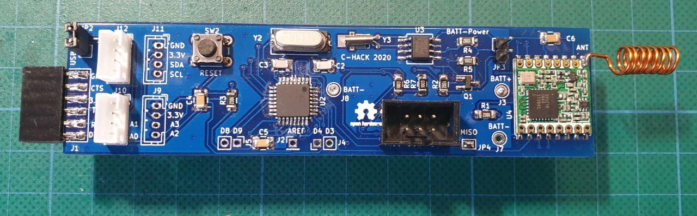
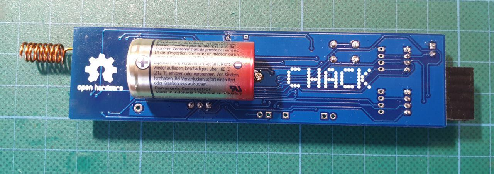

# CaLoRa-Node
## c-hack.de and surasto.de 2020 

This LoRaWAN node is designed to run for long time on a battery.
It uses an external RTC (DS1337) with alarm function to enable or disable the complete power supply by switching a P-MOS FET.
This is the deepest sleep possible.

It uses an Atmel ATMega328 with the Arduino-UNO bootloader.
The LoRAWAN is implemented with an HopeRF RFM95W module.
The board implements some grove compatible connectors wuth I2C and analog inputs of the MCU.

We use the [lmic](https://github.com/matthijskooijman/arduino-lmic "lmic") software library for now but will add a wrapper to make it simpler. 
